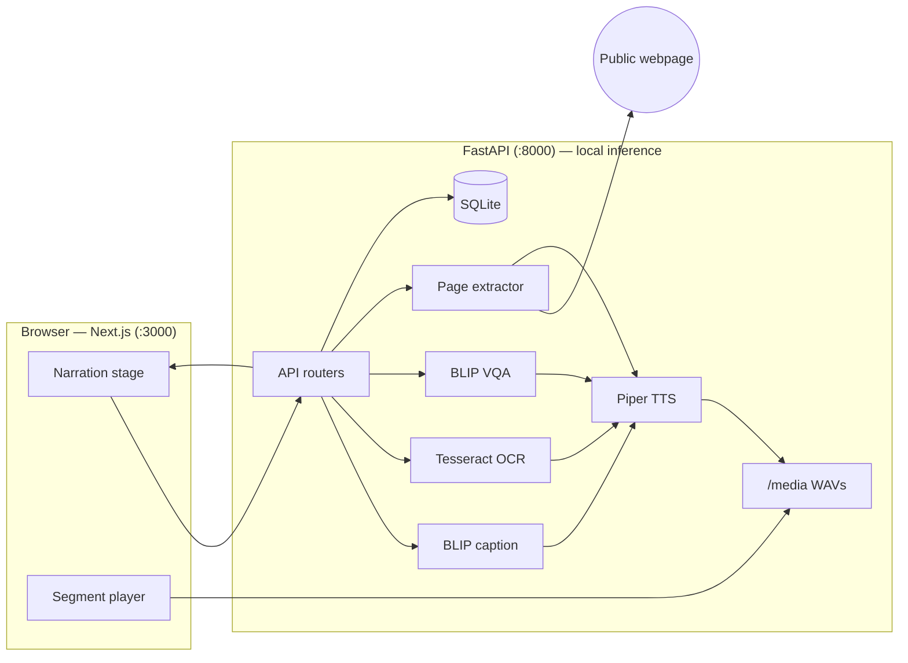

# AI Accessibility Narrator

Private, local, audio-first companion for images and webpages.

**Understand → narrate → ask → hear → stay oriented** — not a generic chatbot.

Built with local, open components and pinned model assets. No paid AI API is required for the MVP. Third-party licenses: [THIRD_PARTY_NOTICES.md](THIRD_PARTY_NOTICES.md).

---

## Screenshots

### Image mode

Upload an image, hear a careful caption, ask a follow-up question, and explore educational perspective filters — all on your machine.


### Webpage mode

Paste a URL (or use a demo fixture), get ordered semantic segments, and read along with play / pause / next / previous controls.


---

## What it does

Helps blind and low-vision users — and anyone who prefers listening — make sense of images and webpages by **hearing** them. The primary action is *listen*, not *type a prompt*.

| Mode | Flow |
| --- | --- |
| **Image** | Drop a photo → local BLIP caption (+ optional OCR) → Piper TTS → segment highlighting |
| **Ask** | Follow-up visual Q&A scoped to the current image session → spoken answer |
| **Webpage** | URL or demo fixture → structural segments → read-along in document order |
| **Perspective** | Educational visual filters (blur, reduced color, high contrast) — non-clinical |

---

## Design principles

- **Private by default** — captioning, VQA, OCR, and TTS run locally. Image bytes are never sent to OpenAI, Anthropic, Google, or any other inference service. Raw image data is never logged. The only outbound call is fetching a webpage URL when you ask for one.
- **Honest descriptions** — uses hedged wording (“appears”, “may”, “I can’t determine”) when unsure; reports parser problems instead of guessing.
- **Accessible first** — semantic HTML, full keyboard navigation, accessible names on every control, no colour-only state, respects `prefers-reduced-motion`.
- **Not a chatbot** — narration is primary; the question box is secondary and session-scoped.

---

## Features (MVP)

- Image upload → local BLIP caption → Piper TTS → segment highlight
- Follow-up visual Q&A tied to the active image session
- Webpage URL / local fixtures → semantic segments → read-along
- Playback speed, previous / next, and live status (“Playing section 3 of 12”)
- Impairments preview (educational, non-clinical)
- Privacy status panel reporting local runtime

---

## Architecture



### Stack

| Layer | Tech | Role |
| --- | --- | --- |
| Frontend | Next.js App Router + TypeScript | Narration stage, highlighting, keyboard player |
| API | FastAPI (Python 3.11) | Routes, validation, model lifecycle |
| Captioning | Salesforce BLIP (`blip-image-captioning-base`) | Image description |
| Visual Q&A | Salesforce BLIP (`blip-vqa-base`) | Session-scoped follow-ups |
| OCR | Tesseract (optional) | Visible text when clearly present |
| Web | httpx + BeautifulSoup, Playwright fallback | Structural page segments |
| TTS | Piper (`en_US-libritts-high`) | One WAV per segment |
| Storage | SQLite + local filesystem | Sessions, segments, uploads, audio |
| Orchestration | Docker Compose | Backend + frontend + model caches |

### Privacy boundary

| Data | Where it goes |
| --- | --- |
| Uploaded images | Local backend only (`backend/storage/uploads`) |
| Model weights | Downloaded once, cached locally |
| Webpage URL | Fetched by the backend (only outbound runtime call) |
| Generated audio | Written locally, served from `/media` |

More detail: [PRD](docs/PRD.md) · [TRD](docs/TRD.md) · [UX & accessibility](docs/UX_ACCESSIBILITY.md)

---

## Quick start (Docker)

Requires Docker Desktop with Linux containers.

```bash
# 1) Build
docker compose build

# 2) Warm model caches (first run ~1–2 GB)
docker compose run --rm -e LOAD_MODELS_ON_STARTUP=0 backend \
  python /scripts/warm_models.py --piper-dir /models/piper

# 3) Start
docker compose up
```

Then open [http://localhost:3000](http://localhost:3000) — API health: [http://localhost:8000/api/health](http://localhost:8000/api/health).

Demo webpage fixture: `fixture:simple_article.html` (see UI hint).

Host-side warm-up (Python 3.11/3.12 — not 3.14):

```bash
cd backend
pip install -r requirements.txt
python ../scripts/warm_models.py --piper-dir ../piper_voices
```

---

## Native fallback

Python **3.11 or 3.12** (not 3.14).

```bash
# Backend
cd backend
python -m venv .venv
# Windows: .venv\Scripts\activate
source .venv/bin/activate
pip install -r requirements.txt
playwright install chromium
set AUDIO_DIR=storage/audio
set PIPER_VOICE_DIR=../piper_voices
set DATABASE_URL=sqlite:///./storage/narrator.db
set DATA_DIR=../data
set LOAD_MODELS_ON_STARTUP=1
python ../scripts/warm_models.py --piper-dir ../piper_voices
uvicorn app.main:app --reload --port 8000

# Frontend (other terminal)
cd frontend
npm install
npm run dev
```

---

## Project layout

```
backend/     FastAPI, BLIP, Piper, webpage extractor
frontend/    Next.js narration stage
data/        Demo images, HTML fixtures, CSVs
docs/        BRD, PRD, TRD, UX, evaluation, demo script
scripts/     Model warm-up + evaluation helpers
image.png    Screenshot — image mode
webpage.png  Screenshot — webpage mode
```

---

## Tests

```bash
cd backend
pytest -q
```

Frontend a11y smoke (after `npm install` + Playwright browsers):

```bash
cd frontend
npx playwright install chromium
npm run test:a11y
```

---

## Differentiation

This project does **not** claim better multimodal intelligence than ChatGPT / Claude / Gemini. The product is the end-to-end assistive workflow: automatic narration, structured page reading, scoped VQA, synchronized highlighting, local inference, and an accessible UI.
