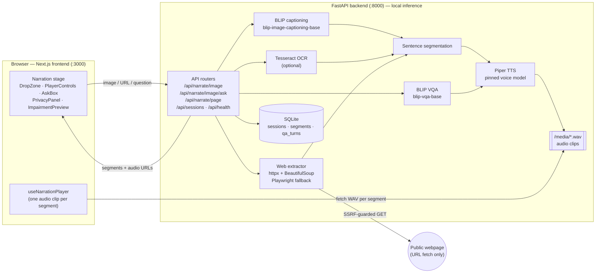

# AI Accessibility Narrator

Private, local, audio-first companion for images and webpages.

This is an assistive workflow: **understand → narrate → ask → hear → stay oriented** — not a generic chatbot.

Built with local, open components and pinned model assets. No paid AI API is required for the MVP. Third-party model and voice licenses are documented in [THIRD_PARTY_NOTICES.md](THIRD_PARTY_NOTICES.md).

## About the project

AI Accessibility Narrator helps blind and low-vision users, and anyone who prefers listening, make sense of images and webpages by **hearing** them. The main action is *listen*, not *type a prompt*.

- **Images:** drop in a photo, screenshot, chart or label. The app writes a short, careful description (with any readable text picked up by OCR), splits it into sentences, and reads it aloud. Each sentence is highlighted as it plays.
- **Follow-up questions:** after the narration, you can ask about the same image (for example, "What colour is the car?"). The answer is spoken back and saved to that image's session. Questions never carry over between images.
- **Webpages:** give it a URL (or a bundled demo fixture). The app pulls out the meaningful structure (title, headings, paragraphs, list items, links, buttons and image alt text) and skips scripts, styles, hidden content and repeated chrome such as nav bars and footers. It then reads the page in document order with read-along highlighting.
- **Staying oriented:** play, pause, next and previous controls, playback speed, and a live status line ("Playing section 3 of 12") keep the listener in control. Everything works from the keyboard and with screen readers.

### Design principles

- **Private by default.** All AI inference (captioning, visual Q&A, OCR, speech) runs on your machine. Image bytes are never sent to OpenAI, Anthropic, Google or any other inference service, and raw image data is never logged. The only outbound network call is fetching a webpage when you ask for one, and it is kept separate from local inference.
- **Honest descriptions.** The narrator avoids inventing visual details. It uses hedged wording ("appears", "may", "I can't determine") when unsure, and it reports parser problems instead of guessing.
- **Accessible first.** Semantic HTML, full keyboard navigation, an accessible name on every control, state that never relies on colour alone, and support for `prefers-reduced-motion`.
- **Not a chatbot.** The narration stage is the main view. The question box is secondary and tied to the current session.

## Architecture



### Components

| Layer | Tech | Responsibility |
| --- | --- | --- |
| Frontend | Next.js App Router + TypeScript | Accessible narration stage, segment highlighting, keyboard player, session-scoped question box, privacy status |
| API | FastAPI (Python 3.11) | Routes in `backend/app/api/`, request validation (`schemas.py`), model lifecycle (`runtime.py`) |
| Captioning | Salesforce BLIP (`blip-image-captioning-base`) | Base description of the uploaded image |
| Visual Q&A | Salesforce BLIP (`blip-vqa-base`) | Answers follow-up questions about the active session's image |
| OCR (stretch) | Tesseract via `pytesseract` | Adds visible text to the caption when clearly present; skipped if not installed |
| Web extraction | httpx + BeautifulSoup, Playwright fallback | Structural, ordered segments from `<main>` / `<article>`; renders JS-heavy pages when static text is too thin |
| TTS | Piper (`en_US-libritts-high`) | Makes one WAV clip per segment, served from `/media` |
| Storage | SQLite + local filesystem | `narration_sessions`, `narration_segments` and `qa_turns` tables; uploads and audio under `backend/storage/` |
| Orchestration | Docker Compose | `backend` and `frontend` services, plus shared volumes for the Hugging Face cache and audio |

### Request flows

**Image → narration**
1. The frontend posts the image to `POST /api/narrate/image`.
2. The backend saves the upload locally, runs BLIP captioning and optional OCR, and splits the result into sentences.
3. Piper makes one WAV per sentence. The session and segments are stored in SQLite.
4. The response returns the ordered segments with `audio_url`, `start_ms` and `end_ms`. The player plays each clip in turn and highlights the matching sentence.

**Follow-up question → spoken answer**
1. The frontend posts `{ session_id, question }` to `POST /api/narrate/image/ask`.
2. The backend looks up that session's image and runs BLIP VQA on it. Piper voices the answer.
3. The Q&A turn is saved against the session, and the answer audio plays right away.

**Webpage → read-along**
1. The frontend posts a URL (or `fixture:<name>.html`) to `POST /api/narrate/page`.
2. The URL passes an SSRF guard: only `http`/`https` URLs are allowed, and private, loopback and link-local addresses are rejected. The page is fetched with a size limit and a timeout.
3. BeautifulSoup strips chrome and hidden nodes, then walks the main landmark and emits typed segments (`heading`, `paragraph`, `link`, `button`, `image_alt`). If the page has too little static text, Playwright renders it first.
4. If extraction is only partial (for example, the page has no `<main>` landmark), the result is marked `partial` and a spoken warning segment is added at the start instead of guessing.
5. Long paragraphs are split into sentences, each segment gets its own WAV, and the frontend reads along segment by segment.

### Audio sync model

In the MVP, sync is **per segment**. Each segment has its own audio clip, and the highlight moves on when that clip's `ended` event fires. Word-level highlighting is deliberately left out until segment-level sync is reliable.

### Privacy boundary

| Data | Where it goes |
| --- | --- |
| Uploaded image bytes | Stay in the local backend (`backend/storage/uploads`) and are never sent to a third-party AI API |
| Model weights | Downloaded once from Hugging Face / Piper releases, then cached locally |
| Webpage URL | Fetched over the network by the backend (the only outbound request at runtime) |
| Generated audio | Written locally and served from `/media` |

More detail is in the `docs/` folder: [PRD](docs/PRD.md), [TRD](docs/TRD.md) and [UX & accessibility](docs/UX_ACCESSIBILITY.md).

## Features (MVP)

- Image upload → local BLIP caption → Piper TTS → segment highlight
- Follow-up visual Q&A scoped to the current image session
- Webpage URL / local fixtures → semantic segments → read-along
- Impairments preview (educational, non-clinical)
- Privacy status panel reporting local runtime

## Quick start (Docker — canonical)

Requires Docker Desktop with Linux containers.

```bash
# 1) Build services
docker compose build

# 2) Warm model caches (first run ~1–2 GB download)
docker compose run --rm -e LOAD_MODELS_ON_STARTUP=0 backend \
  python /scripts/warm_models.py --piper-dir /models/piper

# 3) Start
docker compose up
```

Host-side warm-up alternative (Python 3.11/3.12 recommended — not 3.14):

```bash
cd backend
pip install -r requirements.txt
python ../scripts/warm_models.py --piper-dir ../piper_voices
```

Then open http://localhost:3000 — API at http://localhost:8000/api/health.

Demo fixtures for webpage mode: `fixture:simple_article.html` (see UI hint).

## Native fallback (Python 3.11 or 3.12 — not 3.14)

```bash
# Backend
cd backend
python -m venv .venv
# Windows: .venv\Scripts\activate
source .venv/bin/activate
pip install -r requirements.txt
playwright install chromium
set AUDIO_DIR=storage/audio
set PIPER_VOICE_DIR=../piper_voices
set DATABASE_URL=sqlite:///./storage/narrator.db
set DATA_DIR=../data
set LOAD_MODELS_ON_STARTUP=1
python ../scripts/warm_models.py --piper-dir ../piper_voices
uvicorn app.main:app --reload --port 8000

# Frontend (other terminal)
cd frontend
npm install
npm run dev
```

## Project layout

- `backend/` — FastAPI, BLIP, Piper, webpage extractor
- `frontend/` — Next.js accessible narration stage
- `data/` — demo images, HTML fixtures, CSVs
- `docs/` — BRD, PRD, TRD, UX, evaluation, demo script
- `scripts/` — warm_models + evaluation helpers

## Tests

```bash
cd backend
pytest -q
```

Frontend a11y smoke (after `npm install` + Playwright browsers):

```bash
cd frontend
npx playwright install chromium
npm run test:a11y
```

## Differentiation (honest)

This project does **not** claim better multimodal intelligence than ChatGPT / Claude / Gemini. The product is the end-to-end assistive workflow: automatic narration, structured page reading, scoped VQA, synchronized highlighting, local inference, and an accessible UI.
